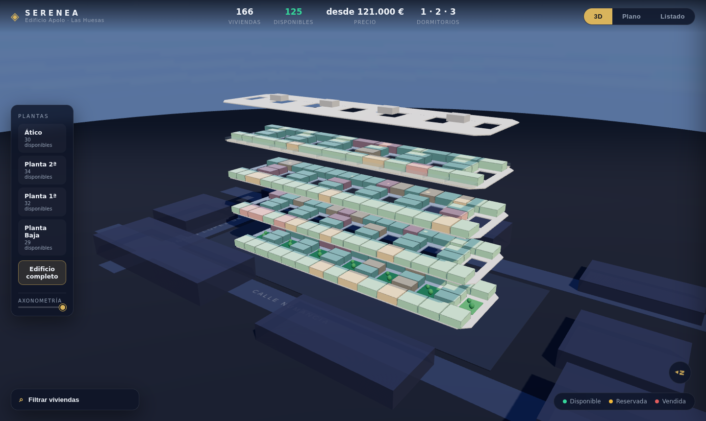

# UNIK · Showroom Virtual — SERENEA

Showroom inmobiliario interactivo en WebGL (Three.js) para el **Edificio Apolo**
(Serenea by Unik, C/ Íñigo López de Mendoza, Las Huesas, Telde): **166 viviendas**
en Planta Baja, 1ª, 2ª y Ático, con patios ajardinados interiores y áticos con terraza.



## ✨ Funcionalidades

- **Multi-promoción / multi-edificio**: portada UNIK con tarjetas por desarrollo
  (`js/promotions.js`), selector de edificio en la cabecera y encuadres por
  edificio. Preparado para los próximos edificios de SERENEA y futuros
  desarrollos: basta añadir entradas al catálogo con su GLB y su listado.
- **Modo día / noche** (conmutador ☀/☾): sol y cielo recalculados, entorno
  IBL regenerado y las ventanas del BIM se encienden de noche.
- **Gestos tipo Google Earth**: un dedo mueve, dos dedos hacen zoom y giran;
  con ratón, izquierdo mueve, derecho gira y rueda hace zoom.
- **Intro cinematográfica**: la cámara desciende desde las nubes hasta el edificio
  (curva Catmull-Rom con easing y zoom de focal), con botón «Saltar intro».
- **Entorno de día** con cielo físico (shader Sky), capa de nubes y post-procesado
  con bloom sutil (EffectComposer + UnrealBloomPass).
- **Maqueta 3D navegable** del edificio (órbita, zoom, encuadres animados), generada
  proceduralmente a partir de las plantas reales del proyecto: dos crujías (Suroeste
  y Noreste), viviendas interiores a los 6 patios ajardinados y ático retranqueado
  con terrazas.
- **Navegación por plantas**: al seleccionar una planta, las superiores se elevan y
  desvanecen y la cámara encuadra la planta con las **etiquetas de cada vivienda**.
- **Viviendas "dollhouse"**: en la planta aislada, cada vivienda se muestra con
  muros en corte, tabiques y mobiliario (baño junto al acceso, cocina abierta,
  salón-comedor y dormitorios con armarios), generados según la tipología real
  de cada unidad e imitando el esquema de distribución de las fichas
  comerciales. El estado comercial tiñe el suelo de cada vivienda.
- **Vista axonométrica** (deslizador que separa las plantas en altura).
- **Modo Plano** (vista cenital de la planta activa) y acceso al **plano comercial
  real** de cada nivel (fichas A3) desde el panel de detalle.
- **Selección de vivienda** con raycasting: tooltip al pasar el ratón y panel de
  detalle con tipología, dormitorios, orientación, superficies, terraza, precio,
  €/m² y estado comercial.
- **Estados comerciales** con código de color: 🟢 disponible · 🟡 reservada · ⚪ vendida (gris, inactiva).
- **Filtros en vivo**: dormitorios, estado, orientación, precio máximo y terraza.
- **Listado completo** ordenable por cualquier columna, enlazado con el 3D.
- **Datos reales** del listado de precios V.01 (agosto 2026): superficies y precios
  de las 166 viviendas.
- **El modelo de Revit es el edificio por defecto**: el BIM (estructura, muros,
  fachadas y patios) se carga siempre y las viviendas se muestran como envolventes
  translúcidas de color posadas sobre los forjados reales, a la cota de su tramo
  (el edificio se escalona con la pendiente) y con los límites de cada vivienda
  ajustados a los muros medianeros reales medidos en el BIM. Las **vendidas son grises e
  inertes**: no reaccionan al ratón ni se pueden seleccionar.
- **Entorno de Las Huesas**: aceras y rasante escalonadas siguiendo los portales
  (según alzados/secciones), campo de fútbol junto a la parcela, parque con
  palmeras, palmeras de alineación en las calles, barrio residencial bajo
  simplificado y solares con vegetación.

## 🚀 Ejecutar en local

Es un sitio 100 % estático (sin build). Basta un servidor de ficheros:

```bash
cd Your-virtual
python3 -m http.server 8080
# → http://localhost:8080
```

O `npx serve`, nginx, GitHub Pages, Netlify, Vercel… cualquier hosting estático.

## 🔌 Conexión con el backend (disponibilidad en tiempo real)

La app funciona hoy con JSON estático (`data/units.json` y `data/availability.json`)
y refresca la disponibilidad cada 60 s. Para conectar un backend real solo hay que
definir las URLs antes de cargar la app (p. ej. en `index.html`):

```html
<script>
  window.APOLO_API = {
    unitsUrl:        'https://api.midominio.com/api/units',        // opcional
    availabilityUrl: 'https://api.midominio.com/api/availability', // recomendado
    leadUrl:         'https://api.midominio.com/api/leads',        // opcional
  };
</script>
```

### Contratos de la API

**GET `availabilityUrl`** — estado comercial por vivienda:

```json
{ "101": "disponible", "102": "reservada", "103": "vendida" }
```

**GET `unitsUrl`** — catálogo completo (mismo esquema que `data/units.json`):

```json
[{ "id": "101", "planta": "Baja", "dorm": 2, "orientacion": "Suroeste",
   "supViv": 60.87, "terraza": 0, "supTotal": 60.87, "precio": 191000 }]
```

**POST `leadUrl`** — solicitud de información:

```json
{ "unitId": "213" }
```

Sin `leadUrl`, el CTA "Solicitar información" abre el correo (mailto).

## 🛰️ Imagen satélite del entorno

El suelo alrededor de la parcela usa teselas de **Esri World Imagery**
proyectadas sobre la rasante en pendiente (con atribución en pantalla). Si las
teselas no cargan, se mantiene el suelo procedural. Para calibrar la posición
exacta y la orientación sin tocar código:

```
?lat=27.9741&lon=-15.3894&bearing=70     (parámetros de URL)
```

o `window.APOLO_GEO = { lat, lon, bearing }` antes de cargar la app. `bearing`
es el rumbo (grados desde el norte) de la C/ Íñigo López de Mendoza.
`?sat=0` desactiva la capa.

## 🏗️ Modelo BIM (Revit)

`assets/apolo_levels.glb` procede del FBX exportado de Revit
(`SERENEA_APOLO_3D.fbx`), procesado con `tools/build_levels.js`:

1. Convierte el FBX a glTF: `npx fbx2gltf -b -i SERENEA_APOLO_3D.fbx -o apolo_raw.glb`
2. `node tools/build_levels.js` (requiere `@gltf-transform/core` y `gl-matrix`):
   asigna cada elemento a su planta lógica según los forjados de su tramo
   (el edificio se escalona con la pendiente), fusiona la geometría por planta
   **y por material** (estructura / muro / vidrio, según la categoría de Revit)
   y genera `levels.json`.
3. Optimización: `weld` + `quantize` con `@gltf-transform/functions`.

Cuando el modelo de Revit avance (le faltan plantas altas en la zona este),
basta repetir estos pasos y sustituir `assets/apolo_levels.glb`.

## 🖼️ Renders

Coloca los renders definitivos en `assets/renders/` y referencia las imágenes en
`js/ui.js` (sección *Imágenes* del panel). Mientras tanto se muestra un
marcador de posición por tipología.

## 📁 Estructura

```
index.html            Página única (overlay UI + canvas WebGL)
css/style.css         Estilos (tema oscuro, glassmorphism)
js/main.js            Escena, cámara, navegación, picking, bucle
js/building.js        Construcción procedural del edificio y entorno
js/layout.js          Distribución real de viviendas por planta y geometría
js/ui.js              Filtros, panel de detalle, listado, tooltip
js/api.js             Capa de datos (backend-ready)
data/units.json       166 viviendas (del listado de precios V.01)
data/availability.json  Estados de demostración (sustituir por backend)
assets/plans/         Planos comerciales por nivel (de las fichas A3)
assets/APOLO_Fichas_Comerciales.pdf  Fichas comerciales descargables
vendor/               Three.js autoalojado (sin CDN)
```

## 📝 Notas

- La maqueta 3D es **esquemática**: respeta el orden, la orientación y la
  proporción de superficies de cada vivienda por planta, no la partición
  exacta de la tabiquería.
- Precios sin IGIC ni gastos. Garaje 15.000 € y trastero 2.000 € opcionales.
  Documento informativo, no contractual.
