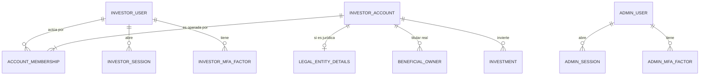
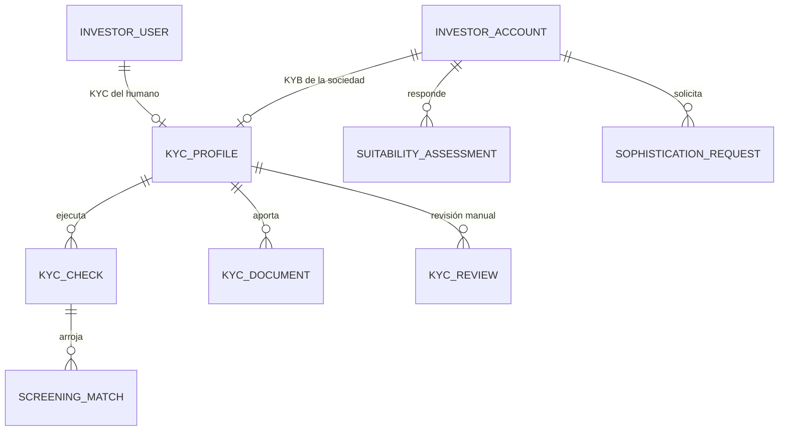
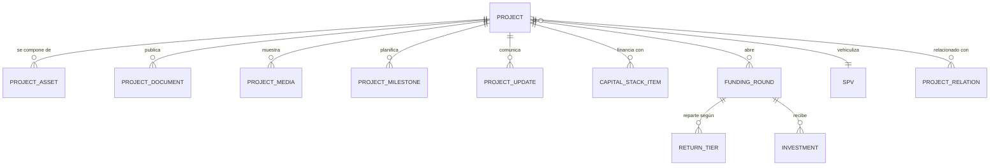
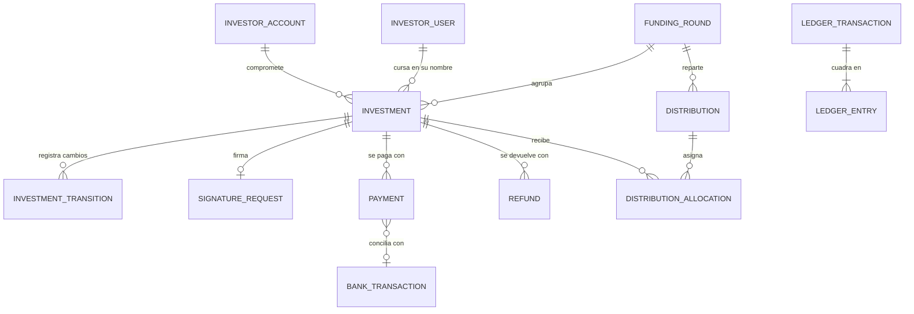
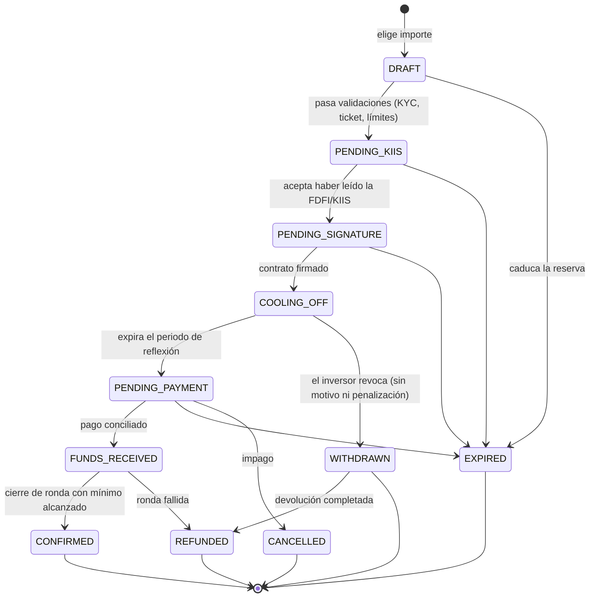
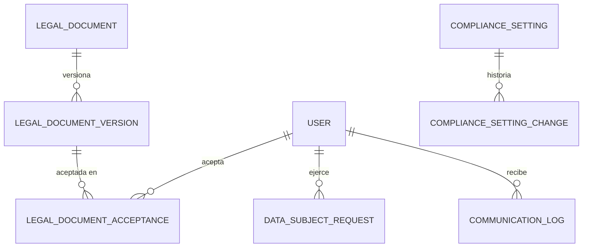

# UMAIA · Plataforma de financiación participativa — Fase 1

**Modelo de datos y arquitectura base**
Versión 0.2 · decisiones 1, 2 y 4 confirmadas por el promotor (ver §6)

> **Aviso.** Este documento es una propuesta técnica. Los umbrales, plazos y
> criterios de clasificación de inversores que aparecen aquí se citan con su
> referencia normativa pero **deben ser validados por la asesoría legal**. El
> diseño los trata como *parámetros configurables en base de datos*, no como
> constantes en código, precisamente para que un cambio de criterio legal no
> exija un despliegue. Ningún dato de este documento debe entenderse como
> asesoramiento jurídico.

---

## 0. Resumen de decisiones

| Decisión | Propuesta | Por qué |
|---|---|---|
| Lenguaje / framework | **TypeScript + Next.js (App Router)** en monorepo, con la lógica de dominio aislada en `packages/core` | Un solo lenguaje para las 3 superficies; SSR para SEO de UMAIA; el showroom 3D existente ya es JS y se integra sin puente |
| Base de datos | **PostgreSQL 16** | Confirmado. Integridad referencial, `NUMERIC`/`BIGINT` exactos, constraints de exclusión, triggers para inmutabilidad, RLS si hiciera falta |
| ORM | **Prisma** para el 95 % + SQL crudo para triggers, vistas de reporting y constraints que Prisma no expresa | Migraciones versionadas y revisables; no renuncio a las garantías del motor |
| Dinero | `BIGINT` en **céntimos** (`*_cents`) + `currency CHAR(3)` | Nunca coma flotante. Sumas y comparaciones exactas |
| Admin | Panel **propio** dentro del mismo Next.js, en un segmento de ruta aislado | Los flujos (cola de KYC, conciliación, cierre de ronda) son a medida; un admin genérico se queda corto en el mes 2 |
| Autenticación | **Dos tablas de credenciales separadas**: `investor_user` y `admin_user`, con sesiones y cookies independientes | Confirmado. Ningún error de programación puede convertir a un inversor en administrador |
| Inversores | **Persona física y jurídica desde el MVP**, separando *quien accede* de *quien invierte* | Confirmado. Ver §2.1: es el cambio de modelo más importante respecto a la v0.1 |
| Auditoría | Tabla `audit_log` **append-only forzada por el motor** (revocación de UPDATE/DELETE + trigger) y encadenada por hash | "Inmutable" a nivel de aplicación no es inmutable |
| Proveedores externos | Todos detrás de un **puerto** (interfaz) con adaptador `mock` explícito y trazado | Enchufar el real es cambiar una variable de entorno, no reescribir el flujo |
| Multi-proyecto | `Project` + `FundingRound` desde el día uno; UMAIA es un registro destacado, no una página especial | Requisito explícito: no rehacer el modelo al añadir Brassie/Serenea |

### Por qué no las otras opciones que planteabas

- **NestJS + Next.js separados.** Es la opción "correcta de libro" y no está mal,
  pero duplica el despliegue, el modelo de auth y los DTOs para un equipo
  pequeño. La propuesta de aislar el dominio en `packages/core` deja la puerta
  abierta: extraer ese paquete a un servicio NestJS más adelante es mecánico,
  porque la lógica de negocio nunca conocerá el objeto `Request` de HTTP.
- **Django.** Tiene el mejor argumento de los tres: `django-simple-history`,
  permisos por objeto maduros y un ORM que respeta constraints de base de datos.
  Lo descarto por una razón de equipo, no técnica: obligaría a mantener dos
  lenguajes (el frontend público y el showroom son JS) y su admin —su principal
  ventaja— **no** sirve para los flujos que necesitas: la cola de revisión de
  KYC con motivo de rechazo, la conciliación de transferencias y el cierre de
  ronda con devoluciones son pantallas de producto, no CRUD.
- **NoSQL.** Descartado por ti y coincido: aquí hay invariantes que solo la base
  de datos puede garantizar bajo concurrencia (que la suma de compromisos no
  supere el objetivo de la ronda, que un pago no se concilie dos veces).

---

## 1. Arquitectura

### 1.1 Estructura del monorepo

```
apps/
  web/            Next.js — 3 superficies, 3 segmentos de ruta:
                    (public)  → landing UMAIA, fichas de proyecto, legales
                    (invest)  → área privada del inversor  [auth: investor]
                    (admin)   → panel interno              [auth: admin + 2FA obligatorio]
  worker/         Trabajos asíncronos: webhooks, emails, expiración de reservas,
                  cierre de ronda, caducidad de KYC, purgas RGPD
packages/
  core/           Dominio puro: entidades, máquinas de estado, reglas de
                  cumplimiento, cálculo de cascada. Sin HTTP, sin Prisma.
  db/             Prisma schema, migraciones, seeds, SQL de triggers y vistas
  providers/      Puertos + adaptadores: kyc/, signature/, payments/, storage/,
                  screening/, email/   (cada uno con implementación `mock`)
  ui/             Componentes compartidos
infra/
  docker-compose.yml   Postgres, MinIO (S3), Mailpit, Redis
```

**Regla de dependencias:** `web` y `worker` dependen de `core`, `db` y
`providers`. `core` no depende de nada. Esto es lo que hace que el dominio sea
testeable sin base de datos y extraíble a un servicio propio si algún día crece.

### 1.2 Separación de las tres superficies

No son tres aplicaciones, pero sí tres perímetros distintos:

- **Cookies de sesión separadas** para inversor y administrador (nombres y
  ámbitos distintos). Un inversor autenticado no arrastra sesión al panel admin.
- **2FA obligatorio** para cualquier `AdminUser`; recomendado y opt-in para el
  inversor en el MVP, con la vía para hacerlo obligatorio por configuración.
- **Middleware de autorización por segmento**, y además comprobación de permiso
  en cada caso de uso del dominio (defensa en profundidad: que la ruta esté
  protegida no exime al servicio de comprobar).
- El panel admin **no se sirve en el mismo dominio público** en producción
  (subdominio propio + posibilidad de restringir por IP).

### 1.3 Módulos de cumplimiento activables

Cada bloque de cumplimiento se controla desde `compliance_setting`, no desde
código:

| Clave | Efecto | Por defecto |
|---|---|---|
| `kyc.level1.required` | Verificación de identidad obligatoria | `true` — **no desactivable por UI**; ver §6 |
| `kyc.level3.threshold_cents` | Umbral de origen de fondos | `50_000_00` *(a validar)* |
| `investment.cooling_off_days` | Periodo de reflexión | `4` *(Art. 22 ECSP: 4 días naturales — validar)* |
| `investment.warning_threshold_cents` | Aviso de inversión relevante | `1_000_00` *(Art. 21.7 ECSP — validar)* |
| `investment.warning_networth_pct` | Alternativa al anterior | `5.0` *(validar)* |
| `kyc.validity_months` | Caducidad de la verificación | `24` |
| `suitability.validity_months` | Caducidad del test de idoneidad | `24` *(Art. 21 ECSP — validar)* |
| `feature.payments_live` | Pasarela real vs. mock | `false` |
| `feature.kyc_provider` | `mock` \| `sumsub` \| `veriff` \| … | `mock` |
| `feature.signature_provider` | `mock` \| `signaturit` \| … | `mock` |

Todo cambio en esta tabla escribe una fila en `compliance_setting_change` con
actor, valor anterior, valor nuevo y motivo. Es la respuesta a "demuéstrame qué
umbral estaba vigente el día que este inversor invirtió".

---

## 2. Modelo de datos

Convenciones: PK `id` UUIDv7 (ordenable temporalmente, no filtrable por
adivinación); `created_at` / `updated_at` en todas las tablas; borrado lógico
solo donde el negocio lo exige (nunca en tablas de auditoría o aceptaciones);
enums como tipos nativos de PostgreSQL.

### 2.1 Identidad y acceso

Aquí es donde más ha cambiado el modelo respecto a la v0.1, por las dos
decisiones confirmadas. La clave es una distinción que la v0.1 no hacía y que
las personas jurídicas vuelven obligatoria:

> **Quien accede no es necesariamente quien invierte.**
> Una persona física invierte en su propio nombre. Una SL invierte a través de
> un apoderado. El mismo humano puede invertir personalmente **y** representar
> a dos sociedades. Si el usuario y el inversor son la misma fila, ese caso
> —que es el más frecuente entre inversores serios— obliga a crear cuentas
> falsas con emails inventados.



**`investor_user`** — el humano que inicia sesión. `email` (citext, único),
`password_hash` (argon2id), `email_verified_at`, `status`
(`ACTIVE|LOCKED|SUSPENDED|CLOSED`), `locale`, `last_login_at`, y sus datos
personales de identidad (nombre, apellidos, fecha de nacimiento, nacionalidad,
tipo y número de documento cifrado, teléfono, domicilio). **Todo humano que
toque la plataforma se verifica**, sea inversor directo o apoderado de una
sociedad: el apoderado que firma también pasa KYC.

**`investor_account`** — la **parte inversora**, que es quien aparece en el
contrato. `type` (`NATURAL|LEGAL`), `display_name`, `tax_residence_country`,
**`iban_encrypted`** (devoluciones y distribuciones), `classification`
(`NON_SOPHISTICATED|SOPHISTICATED`), `classification_valid_until`,
`onboarding_status`, `status`.
Al registrarse una persona física se crea automáticamente su cuenta `NATURAL`
con una membresía `OWNER`; el usuario nunca ve este concepto. Al dar de alta una
sociedad, se crea una cuenta `LEGAL` adicional.

**`account_membership`** — `investor_user_id`, `investor_account_id`, `role`
(`OWNER|REPRESENTATIVE|VIEWER`), `powers_document_id` (la escritura de poder),
`valid_until`, `status` (`PENDING_APPROVAL|ACTIVE|REVOKED`), `approved_by_admin_id`.
Una representación de una sociedad **no se autoconcede**: la aprueba
cumplimiento tras revisar el poder, y puede caducar.

**`legal_entity_details`** — 1:1 con las cuentas `LEGAL`: razón social, CIF,
forma jurídica, domicilio social, datos registrales, CNAE, fecha de
constitución.

**`beneficial_owner`** — titulares reales de la sociedad, exigencia de PBC:
nombre, documento cifrado, `ownership_pct`, `control_type`, y su propio estado
de cribado PEP/sanciones. Una cuenta `LEGAL` no puede aprobarse sin ellos.

**`admin_user`** — **tabla de credenciales completamente separada**, decisión
confirmada. Email, `password_hash`, `role`
(`SUPER_ADMIN|COMPLIANCE_OFFICER|KYC_REVIEWER|PROJECT_MANAGER|ACCOUNTING_READONLY`),
`is_active`, `mfa_enrolled_at`. No hay ninguna ruta de datos por la que una fila
de `investor_user` se convierta en administrador: son tablas distintas, con
sesiones distintas (`admin_session` / `investor_session`), cookies de nombre y
ámbito distintos, y 2FA obligatorio en el lado admin.

> **Coste de esta decisión, para que quede dicho.** Duplica el código de
> autenticación. Lo contengo poniendo las *primitivas* compartidas en
> `packages/auth` (hashing argon2id, TOTP, tokens, limitación de intentos) y
> dejando separado solo lo que debe estarlo: las tablas de credenciales, las
> tablas de sesión y los guardias. Es la lectura conjunta de tus respuestas 1 y
> 2 — separación donde aporta seguridad, sin duplicar lo que solo aporta trabajo.

**`investor_mfa_factor`** / **`admin_mfa_factor`** — `type` (`TOTP|WEBAUTHN`),
secreto cifrado, `confirmed_at`, `last_used_at`; códigos de recuperación
hasheados y de un solo uso en tabla aparte.

**`auth_attempt`** — registro de intentos para bloqueo y limitación de
frecuencia, con `realm` (`INVESTOR|ADMIN`). Es un registro de eventos, no un
almacén de credenciales, así que aquí una sola tabla no debilita la separación.

**`password_reset_token`**, **`email_verification_token`** — hasheados, de un
solo uso y con caducidad corta, también con `realm`.

### 2.2 KYC / AML

Con personas jurídicas en el alcance hay **dos sujetos verificables** distintos:
el humano (KYC clásico) y la sociedad (KYB: verificación societaria + titulares
reales). Comparten estructura, así que `kyc_profile` apunta a uno u otro.



**`kyc_profile`** — `subject_type` (`INVESTOR_USER|INVESTOR_ACCOUNT`) con dos
claves ajenas anulables y un `CHECK` que obliga a que exactamente una esté
informada. Prefiero esto a un identificador polimórfico suelto porque conserva
la integridad referencial: la base de datos sigue impidiendo apuntar a un sujeto
que no existe.
`level_reached` (`0|1|2|3`), `status`
(`NOT_STARTED|PENDING_DOCUMENTS|IN_REVIEW|APPROVED|REJECTED|EXPIRED|SUSPENDED`),
`rejection_reason_code` + `rejection_reason_text`, `approved_at`,
`approved_by_admin_id`, **`expires_at`**, `risk_rating`
(`LOW|MEDIUM|HIGH` — asignado por revisor o proveedor, **nunca calculado por
nosotros**), `last_screened_at`.

**`kyc_check`** — una fila **por comprobación individual**, que es lo que
permite enchufar proveedores sin tocar el flujo:
`kyc_profile_id`, `check_type`
(`IDENTITY_DOCUMENT|LIVENESS|ADDRESS|PEP_SANCTIONS|ADVERSE_MEDIA|SOURCE_OF_FUNDS`),
`provider` (`mock|sumsub|veriff|onfido|complyadvantage|manual`),
`provider_reference`, `status`
(`REQUESTED|PENDING|PASSED|FAILED|NEEDS_REVIEW|ERROR`),
`result_payload_ref` (puntero al blob cifrado con la respuesta cruda del
proveedor — **no la interpretamos, la conservamos**), `requested_at`,
`resolved_at`, `reviewed_by_admin_id`.

**`screening_match`** — cada coincidencia de PEP/sanciones que devuelva el
proveedor: `match_type`, `matched_name`, `list_source`, `score_from_provider`,
`disposition` (`PENDING|TRUE_POSITIVE|FALSE_POSITIVE`), `disposition_reason`,
`disposition_by_admin_id`, `disposition_at`. **Ninguna coincidencia se descarta
automáticamente**: un humano la dispone y queda registrado quién y por qué.

**`kyc_document`** — `document_type`
(`ID_FRONT|ID_BACK|SELFIE|PROOF_OF_ADDRESS|SOURCE_OF_FUNDS_EVIDENCE|CORPORATE_DEED`),
`storage_key` (S3), `content_sha256`, `encryption_key_version`, `mime_type`,
`size_bytes`, `uploaded_at`, `retention_until`, `deleted_at`.
El fichero **nunca** se sirve directamente: solo por URL firmada de vida corta
tras comprobar la propiedad, y cada descarga escribe en `audit_log`.

**`suitability_assessment`** — el test de idoneidad (conocimientos + simulación
de capacidad de soportar pérdidas). Cuelga de **`investor_account`**, no del
usuario: quien se clasifica como sofisticado o no sofisticado es la parte que
invierte, y los criterios para personas jurídicas son distintos de los de
personas físicas *(Anexo II ECSP — a validar)*. Se registra además qué
`investor_user` lo cumplimentó.
`questionnaire_version_id`, `answers` (JSONB), `knowledge_outcome`
(`PASS|FAIL`), `declared_net_worth_cents`, `declared_annual_income_cents`,
`loss_bearing_capacity_cents` (resultado de la simulación),
`outcome` (`PASSED|FAILED_WARNING_ACKNOWLEDGED|NOT_REQUIRED_SOPHISTICATED`),
`warning_acknowledged_at`, `completed_at`, **`valid_until`**.
Las respuestas se guardan íntegras junto a la **versión del cuestionario**: si
mañana cambiáis las preguntas, sigue siendo demostrable qué contestó cada
inversor a qué pregunta.

**`sophistication_request`** — vía simplificada: `self_certification_at`,
`criteria_claimed` (JSONB con los criterios alegados),
`evidence_document_ids`, `status` (`PENDING|APPROVED|REJECTED`),
`decided_by_admin_id`, `decided_at`, `valid_until`. La autocalificación **no
basta por sí sola**: requiere aprobación explícita de un `COMPLIANCE_OFFICER`,
y caduca.

**`kyc_review`** — cada paso por la cola de revisión manual: revisor, decisión,
motivo, adjuntos, timestamps. Histórico, no se sobrescribe.

### 2.3 Proyectos



**`project`** — `slug` (único, para la URL), `name`, `tagline`, `status`
(`DRAFT|PUBLISHED|FUNDING_OPEN|FUNDING_CLOSED|FULLY_FUNDED|FUNDING_FAILED|IN_EXECUTION|EXITED|CANCELLED`),
`asset_class` (`RESIDENTIAL|COMMERCIAL|MIXED|LAND`), `city`, `province`,
`country`, `latitude`, `longitude`, `address`, `description_md`,
`target_return_pct`, `return_type` (`TIR|MULTIPLE|FIXED_COUPON`),
`term_months`, `is_featured` (UMAIA), `display_order`, `published_at`,
`risk_warning_version_id`, **`showroom_url`** (enganche con el showroom 3D que
ya existe en este repositorio), `spv_id`.

> El "mono-proyecto" es una **consulta**, no una estructura: la portada carga
> `project where is_featured = true`, y "proyectos relacionados" es el resto
> filtrado por `PROJECT_RELATION` o por `display_order`. Añadir Brassie o
> Serenea será insertar filas.

**`project_asset`** — los 4 edificios residenciales + la parcela comercial de
UMAIA, cada uno con `asset_type` (`RESIDENTIAL_BUILDING|COMMERCIAL_PLOT|…`),
`name`, `units_count`, `built_surface_m2`, `plot_surface_m2`,
`cadastral_reference`, `intended_use`, `estimated_value_cents`. Esto es lo que
permite contar la historia de UMAIA con precisión (y, más adelante, decir que la
parcela terciaria se vendió a un operador sin inventar un campo suelto).

**`spv`** — vehículo: `legal_name`, `cif`, `registry_data`, `incorporated_at`.
Un proyecto = un vehículo, normalmente; el modelo permite reutilizarlo.

**`project_document`** — **versionado, nunca sobrescrito**:
`document_type` (`MEMORIA|KIIS|ACCOUNTS|APPRAISAL|LICENSE|CONTRACT_TEMPLATE|OTHER`),
`version` (entero incremental por tipo y proyecto), `title`, `storage_key`,
`content_sha256`, `visibility` (`PUBLIC|AUTHENTICATED|INVESTORS_ONLY`),
`effective_from`, `superseded_by_id`, `published_by_admin_id`.
Constraint: único `(project_id, document_type, version)`, y como máximo un
documento vigente por tipo (`superseded_by_id IS NULL`).

**`funding_round`** — separo la ronda del proyecto. `project_id`,
`round_number`, `status`
(`DRAFT|OPEN|CLOSED_SUCCESS|CLOSED_FAILED|CANCELLED`),
`target_amount_cents`, **`minimum_amount_cents`** (por debajo del cual la ronda
fracasa y se devuelve), `min_ticket_cents`, `max_ticket_per_investor_cents`,
`currency`, `opens_at`, `closes_at`, `closed_at`, `kiis_document_id`
(la ficha de datos fundamentales **vigente para esta ronda**),
`contract_template_document_id`, `platform_fee_pct`, `success_fee_pct`.

> **Por qué una tabla aparte.** Si los importes de captación viven en `project`,
> una segunda ronda del mismo proyecto obliga a duplicar el proyecto o a
> falsear los históricos. Con `funding_round`, "% cubierto" es una agregación
> sobre las inversiones de la ronda abierta y el histórico queda intacto.

**`capital_stack_item`** — orden de prelación: `seniority` (entero, 1 = más
senior), `label` ("Deuda bancaria", "Capital inversores", "Promotor"),
`amount_cents`, `provider_name`, `notes`. Es lo que se pinta en el frontend
como estructura financiera.

**`return_tier`** — la cascada: `tier_order`, `label`, `hurdle_pct`,
`split_investors_pct`, `split_sponsor_pct`, `description`. El simulador de
inversión del frontend consume esto, así que la cifra que ve el usuario y la
que documentáis son el mismo dato.

**`project_media`**, **`project_milestone`** (cronograma: hito, fecha estimada,
fecha real, estado), **`project_update`** (novedades para inversores),
**`project_relation`** (`project_id`, `related_project_id`, `display_order`).

### 2.4 Inversión, pagos y liquidación



**`investment`** — el compromiso.
`investor_account_id` (**quién invierte**, la parte contractual),
`placed_by_investor_user_id` (**quién la cursó**, el humano — para personas
jurídicas, el apoderado), `funding_round_id`, `project_id` (denormalizado para
consultas y para que un cambio de ronda nunca huérfane el histórico),
`amount_cents`, `currency`, `status`, `reference` (código legible para el
inversor y para el concepto de la transferencia), y los sellos de tiempo del
flujo:
`reserved_at`, `kiis_presented_at`, `kiis_acknowledged_at`, `signed_at`,
**`cooling_off_ends_at`**, `funds_received_at`, `confirmed_at`,
`withdrawn_at`, `cancelled_at`, `refunded_at`, `cancellation_reason`.
Además: `suitability_assessment_id` y `kyc_profile_snapshot`
(qué nivel de KYC tenía el inversor **en el momento** de invertir),
`warning_shown` / `warning_acknowledged_at` (el aviso por superar el umbral).

Máquina de estados:



Notas de diseño sobre este flujo:

1. **La FDFI/KIIS se presenta antes de poder firmar**, y se registra qué
   *versión concreta* del documento se mostró (`kiis_document_id` en la ronda +
   `LegalDocumentAcceptance`). No es un checkbox suelto.
2. **El periodo de reflexión ocurre *antes* del pago.** El inversor firma, se
   abre la ventana de revocación, y solo cuando expira se le pide el dinero.
   Cambio respecto a la v0.1, que preveía cobrar y retener en la cuenta de
   garantía: es más protector para el inversor y elimina toda una familia de
   estados en los que hay dinero de alguien que todavía puede echarse atrás.
   Aun así `WITHDRAWN` y `REFUNDED` siguen siendo estados distintos, porque una
   revocación puede coincidir con un pago ya emitido.
   Si más adelante queréis cobrar durante la reflexión —lo hacen otras
   plataformas—, las transiciones a abrir están anotadas en
   `packages/core/src/investment-flow.ts`.
3. **`investment_transition`** guarda cada cambio de estado (estado origen,
   destino, actor, motivo, timestamp). Es redundante con `audit_log` a
   propósito: el log de auditoría es transversal y voluminoso; esta tabla es la
   biografía legible de una inversión concreta.
4. La transición a `CONFIRMED` solo la hace el **cierre de ronda**, en una
   transacción que comprueba el mínimo. Ninguna ruta HTTP la provoca
   directamente.

**`signature_request`** — `provider` (`mock|signaturit|docusign`),
`provider_envelope_id`, `status`, `signed_document_storage_key`,
`signed_document_sha256`, `signer_ip`, `signer_user_agent`, `sent_at`,
`signed_at`, `evidence_package_key` (el acta/evidencia que devuelve el
proveedor — es la pieza que sostiene la firma ante un tribunal).

**`payment`** — `investment_id`, `method`
(`CARD|SEPA_CREDIT_TRANSFER|SEPA_DIRECT_DEBIT`), `provider`
(`mock|stripe|manual`), `provider_reference`, `amount_cents`, `status`
(`INITIATED|PENDING|SUCCEEDED|FAILED|REVERSED`), `paid_at`, `reconciled_at`,
`reconciled_by_admin_id`, `bank_transaction_id`, `idempotency_key` (único).

**`bank_transaction`** — líneas de extracto importadas (CSV/Norma 43/CAMT.053)
para conciliar transferencias manuales: `value_date`, `amount_cents`,
`counterparty_name`, `counterparty_iban`, `concept`, `bank_reference` (único),
`matched_payment_id`, `matched_by_admin_id`. Constraint: una línea de extracto
solo puede casar con **un** pago.

**`refund`** — devoluciones por revocación o ronda fallida: importe, motivo,
IBAN destino, estado, referencia, quién la autorizó.

**`distribution`** / **`distribution_allocation`** — repartos a inversores
(intereses, principal, plusvalía) con `gross_cents`, `withholding_cents`
(retención) y `net_cents` por inversor. Alimenta el histórico de movimientos y
los certificados fiscales.

**Libro mayor de partida doble** — `ledger_account`, `ledger_transaction`,
`ledger_entry` (`debit_cents` / `credit_cents`), con la invariante de que las
entradas de una transacción suman cero, comprobada por trigger. Las cuentas son
del tipo `ESCROW:round:<id>`, `INVESTOR:<id>`, `PLATFORM_FEES`, `BANK:<iban>`.

> **Por qué un libro mayor y no un campo `saldo`.** Un saldo mutable es
> imposible de auditar cuando algo cuadra mal: no sabes qué movimiento lo rompió.
> Con partida doble, el saldo es una agregación y cada euro tiene su origen.
> Para una plataforma que custodia dinero de terceros esto no es sobreingeniería,
> es el mínimo para poder responder a un auditor. **Se puede implementar en la
> fase 4** —el modelo lo contempla desde ahora para no retrofitear.

### 2.5 Trazabilidad legal, auditoría y RGPD



**`legal_document`** + **`legal_document_version`** — `slug`
(`terms-of-use`, `privacy-policy`, `cookies`, `investment-contract`,
`risk-warnings`, `kiis`), y por versión: `version_label`, `locale`,
`content_md` o `storage_key`, **`content_sha256`**, `effective_from`,
`effective_until`, `requires_acceptance`, `published_by_admin_id`.
Una versión publicada **es inmutable**: corregir una errata es publicar la
siguiente versión.

**`legal_document_acceptance`** — append-only. `user_id`,
`legal_document_version_id`, `accepted_at`, `ip_address`, `user_agent`,
`context` (`REGISTRATION|INVESTMENT|KYC|PROFILE_UPDATE`), `context_id`
(p. ej. el `investment_id`), `content_sha256_at_acceptance` (copiado, no
referenciado: si alguien manipulase la fila de la versión, el hash guardado aquí
lo delata).

**`audit_log`** — la pieza crítica. `occurred_at`, `actor_type`
(`INVESTOR|ADMIN|SYSTEM|PROVIDER`), `actor_id`, `actor_ip`, `request_id`,
`action` (`kyc.approved`, `investment.confirmed`, `document.downloaded`,
`setting.changed`, …), `entity_type`, `entity_id`, `before` / `after` (JSONB
**con los campos sensibles redactados**, no en claro), `metadata`,
`prev_hash`, `hash`.

Inmutabilidad real, no por convención:

```sql
-- 1. El rol de la aplicación solo puede insertar
REVOKE UPDATE, DELETE, TRUNCATE ON audit_log FROM umaia_app;
GRANT  INSERT, SELECT              ON audit_log TO   umaia_app;

-- 2. Y aunque alguien escalase privilegios, el trigger lo bloquea
CREATE OR REPLACE FUNCTION audit_log_is_append_only() RETURNS trigger AS $$
BEGIN
  RAISE EXCEPTION 'audit_log es append-only (intento de %)', TG_OP;
END; $$ LANGUAGE plpgsql;

CREATE TRIGGER audit_log_no_mutation
  BEFORE UPDATE OR DELETE ON audit_log
  FOR EACH ROW EXECUTE FUNCTION audit_log_is_append_only();
```

Cada fila encadena `hash = sha256(prev_hash || payload_canónico)`, y un trabajo
diario verifica la cadena y sella el último hash en un almacenamiento aparte
(WORM / bucket con object-lock). Con eso, un borrado o una modificación en la
base de datos son **detectables**, que es lo máximo que puede ofrecer un sistema
que no sea un notario externo.

Toda acción sobre `investment` y `kyc_profile` escribe en `audit_log` de forma
obligatoria: se hace **en la misma transacción de base de datos** que el cambio,
desde el repositorio, no desde la capa HTTP. Si el log falla, la operación falla.

**`compliance_setting`** + **`compliance_setting_change`** — descrito en §1.3.

**`data_subject_request`** (RGPD) — `type`
(`ACCESS|RECTIFICATION|ERASURE|PORTABILITY|OBJECTION|RESTRICTION`), `status`,
`requested_at`, `due_at` (un mes), `handled_by_admin_id`, `resolution_notes`,
`export_storage_key`.

> **Conflicto real que hay que resolver por diseño, no por sorpresa.** El
> derecho de supresión **no** puede borrar la documentación de diligencia
> debida: la normativa de prevención del blanqueo obliga a conservarla durante
> **10 años** *(Ley 10/2010, art. 25 — a confirmar por la asesoría)*. La
> implementación del "borrado" será por tanto: eliminación de datos de marketing
> y perfil, **pseudonimización** del resto, y bloqueo del expediente PBC hasta
> que expire su plazo de retención, momento en el que un trabajo programado lo
> purga. El panel admin debe mostrar esta distinción al operador para que la
> respuesta al interesado sea honesta.

**`communication_log`** — histórico de comunicaciones con el inversor:
canal, plantilla, versión, asunto, destinatario, `sent_at`, `provider_message_id`,
estado de entrega. Requisito explícito del panel admin.

**`webhook_event`** — todo callback de proveedor: `provider`, `event_id`
(único, para idempotencia), `signature_verified`, `payload` (crudo),
`processed_at`, `processing_error`. Los webhooks nunca se procesan en línea:
se persisten y el worker los consume.

### 2.6 Invariantes que hace cumplir la base de datos

No como validación de aplicación, sino como constraint:

| Invariante | Mecanismo |
|---|---|
| `amount_cents > 0` en inversiones y pagos | `CHECK` |
| Ticket dentro de `[min_ticket, max_ticket]` de la ronda | `CHECK` con función + validación en dominio |
| La suma de inversiones vivas no supera el objetivo de la ronda | Transacción con `SELECT … FOR UPDATE` sobre `funding_round` |
| Un `bank_transaction` concilia como máximo un `payment` | Índice único parcial |
| Un solo documento vigente por `(project, document_type)` | Índice único parcial sobre `superseded_by_id IS NULL` |
| Una ronda `OPEN` por proyecto como máximo | Índice único parcial |
| Las entradas de un asiento suman cero | Trigger `AFTER INSERT` diferido |
| `audit_log` y `legal_document_acceptance` no se modifican | Revocación de permisos + trigger |
| Reintento de pago no duplica cobro | `idempotency_key` único |

---

## 3. Seguridad y protección de datos

- **Secretos**: nada en código. `.env.example` documentado, valores reales por
  variables de entorno / gestor de secretos. El repositorio lleva un hook de
  pre-commit con detección de secretos desde el primer commit.
- **Cifrado en reposo**: cifrado de sobre a nivel de campo (AES-256-GCM, clave
  de datos envuelta por una clave maestra del KMS) para `national_id`, `iban`,
  secretos de 2FA y respuestas crudas de proveedores KYC. Se guarda
  `encryption_key_version` en cada fila para permitir rotación de claves.
- **Documentos**: bucket S3 privado, cifrado con clave gestionada, sin acceso
  público jamás. Descarga solo por URL firmada de ≤ 5 minutos emitida tras
  comprobar propiedad; cada emisión queda en `audit_log`.
- **Rate limiting**: por IP y por cuenta en login, registro, recuperación de
  contraseña, verificación 2FA, subida de documentos KYC y confirmación de
  inversión. Bloqueo progresivo tras intentos fallidos.
- **Autorización**: comprobación en el caso de uso, no solo en la ruta. Los
  identificadores son UUIDv7 (no enumerables) pero eso **no sustituye** a la
  comprobación de propiedad.
- **Minimización RGPD**: no se pide un dato que no tenga base legal
  identificada. Cada campo sensible del esquema llevará anotado en el `schema.prisma`
  su base jurídica y su plazo de retención, para poder generar el registro de
  actividades de tratamiento a partir del propio modelo.

---

## 4. Cómo se enchufan los proveedores reales

Cada integración es un puerto en `packages/providers`. Ejemplo del de identidad:

```ts
export interface KycProvider {
  readonly name: string;
  startVerification(input: StartVerificationInput): Promise<VerificationSession>;
  getResult(providerReference: string): Promise<VerificationResult>;
  verifyWebhook(raw: string, signature: string): WebhookEvent;
}
```

Los adaptadores `mock` de desarrollo cumplen dos reglas **no negociables**:

1. **Nunca aprueban solos.** Dejan la comprobación en `NEEDS_REVIEW` y exigen
   que un `KYC_REVIEWER` la resuelva a mano en el panel. El mock simula la
   *mecánica* del proveedor (subida, callback, estados), no su *criterio*.
2. **Quedan marcados.** `kyc_check.provider = 'mock'` es permanente, así que
   siempre se puede listar qué expedientes se aprobaron sin proveedor real —
   que es exactamente lo que preguntará un auditor o la CNMV.

Además, la aplicación **se niega a arrancar** con `NODE_ENV=production` y un
proveedor KYC en `mock`, salvo que se active una variable de entorno explícita
que además escribe un aviso permanente en el panel de administración. Si en
algún momento pedís desactivar la verificación de identidad para "ir más rápido
en pruebas", el sistema lo permitirá solo en entornos de desarrollo y siempre
dejando rastro.

Los mismos puertos, con la misma disciplina, para firma electrónica
(`SignatureProvider`), pagos (`PaymentProvider`), cribado
(`ScreeningProvider`), almacenamiento (`StorageProvider`) y correo.

---

## 5. Qué deja fuera este modelo (a propósito)

- **Mercado secundario / tablón de anuncios** de participaciones. Es un módulo
  con reglas propias; el modelo no lo impide (una `investment` es transferible
  conceptualmente) pero no lo diseño ahora.
- **Multidivisa real.** Hay columna `currency`, pero el MVP asume EUR.
- **Fiscalidad avanzada** (retenciones por país de residencia, modelos
  tributarios). Se modela `withholding_cents`; las reglas concretas las tiene
  que dictar el asesor fiscal.
- **Sindicación / co-inversión por tramos** con condiciones distintas por
  inversor.
- **Contabilidad completa de la SPV.** El libro mayor cubre el flujo de la
  plataforma, no la contabilidad societaria del vehículo.

---

## 6. Estado de las decisiones

### Confirmadas

| # | Decisión | Resolución |
|---|---|---|
| 1 | Stack | **TypeScript / Next.js en monorepo** — respuesta: "el más fácil de mantener". Un lenguaje, un despliegue, un modelo de datos |
| 2 | Credenciales | **Separadas**: `investor_user` y `admin_user` son tablas distintas, con sesiones y cookies propias |
| 4 | Tipo de inversor | **Personas físicas y jurídicas** en el MVP → modelo `investor_user` / `investor_account` / `account_membership` / `beneficial_owner` |

### Resueltas por defecto (decid si no os convence)

| # | Decisión | Qué he hecho | Reversible |
|---|---|---|---|
| 3 | Libro mayor | **Modelado ahora, implementado en fase 4.** Las tablas existen y el trigger de cuadre también; el flujo de inversión aún no escribe asientos | Sí, barato |
| 6 | Showroom 3D | `project.showroom_url` como campo opcional. El showroom actual **no se toca**: la plataforma vive en `platform/`, él sigue sirviéndose desde la raíz | Sí, barato |
| 7 | Idioma | **Español**, con `locale` presente en documentos legales y contenidos. Sin infraestructura de i18n en el MVP | Añadirlo después cuesta más, pero no exige migración |

### Bloqueantes para producción, no para desarrollo

**Parámetros legales.** Todo lo marcado *(a validar)* en §1.3 necesita
confirmación de la asesoría: días de reflexión, umbral de origen de fondos,
umbrales de aviso, criterios de inversor sofisticado —**incluidos los de persona
jurídica**, que ahora aplican— y plazos de retención. Son filas de
`compliance_setting`, así que cambiarlos es editar configuración, no desplegar.

**Autorización CNMV como PSFP.** Fuera del alcance de este trabajo. La
plataforma no debe captar dinero real hasta que exista.

---

## 7. Entrega de la fase 1

Todo el código vive bajo **`platform/`**, para no interferir con el showroom 3D
que se sirve desde la raíz del repositorio.

- `platform/packages/db`: `schema.prisma` completo, migración inicial generada y
  el SQL de triggers/constraints de §2.6.
- `platform/packages/core`: dominio y máquinas de estado de `Investment` y
  `KycProfile`, con tests unitarios que corren sin base de datos.
- `platform/packages/auth`: primitivas compartidas por los dos perímetros.
- `platform/packages/providers`: puertos y adaptadores `mock`.
- `platform/apps/web`: esqueleto de Next.js con los tres segmentos de ruta,
  middleware por perímetro y páginas vacías. **Sin lógica de negocio.**
- `platform/apps/worker`: esqueleto con los trabajos declarados.
- `platform/infra/docker-compose.yml`: Postgres + MinIO + Mailpit + Redis.
- Seed con UMAIA, sus 5 activos, su ronda y dos proyectos relacionados.
- `.env.example` documentado.

Nada se despliega. Todo queda en la rama `claude/umaia-crowdfunding-platform-zo1bpd`.
